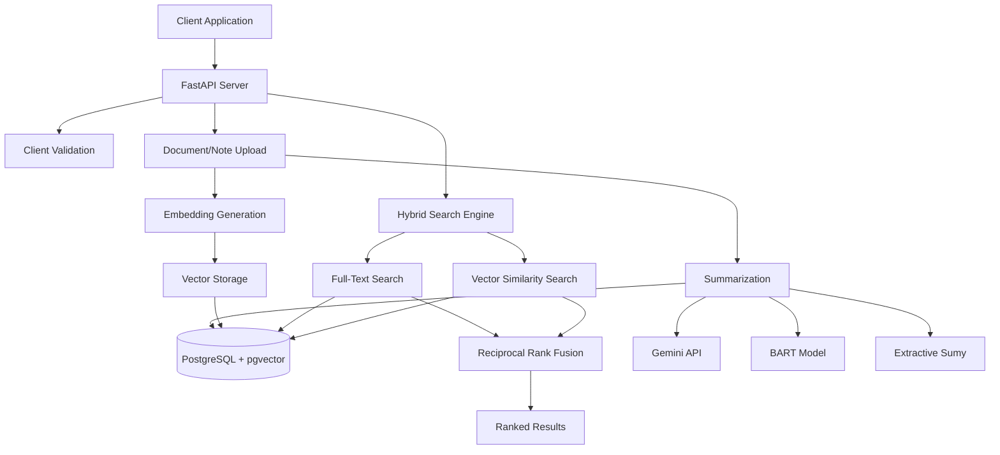

# WealthTech Smart Search API

- [WealthTech Smart Search API](#wealthtech-smart-search-api)
  - [🔍 Key Features](#-key-features)
  - [🚀 Quick Start](#-quick-start)
    - [1. Clone \& Setup](#1-clone--setup)
    - [2. Verify Setup](#2-verify-setup)
  - [🤖 Summarization Techniques](#-summarization-techniques)
    - [Gemini API (Default)](#gemini-api-default)
    - [BART Transformer](#bart-transformer)
    - [Extractive](#extractive)
  - [🏗️ Architecture](#️-architecture)
    - [Design Trade-offs](#design-trade-offs)
  - [📁 Code Structure](#-code-structure)
  - [📡 API Usage](#-api-usage)
    - [Endpoints](#endpoints)
    - [Upload Examples](#upload-examples)
    - [Search Examples](#search-examples)
    - [Response Comparison](#response-comparison)
    - [Semantic Search Example](#semantic-search-example)
    - [Test Coverage](#test-coverage)
    - [Running Tests](#running-tests)
    - [Test Data](#test-data)
  - [📚 Documentation](#-documentation)
    - [Auto-Update Documentation](#auto-update-documentation)
  - [🆘 Troubleshooting](#-troubleshooting)
    - [Common Issues](#common-issues)

---


A hybrid search system for financial advisors to search client documents and meeting notes using both keyword and semantic search, with AI-powered summarization.

## 🔍 Key Features

- **Hybrid Search**: Combines PostgreSQL full-text search with vector similarity using Reciprocal Rank Fusion
- **Semantic Understanding**: sentence-transformers embeddings with pgvector for context-aware search
- **AI Summarization**: Multiple techniques - Gemini API, BART transformer, and extractive methods
- **Financial Focus**: Optimized for investment documents, meeting notes, and client communications

## 🚀 Quick Start

### 1. Clone & Setup
```bash
git clone <repo-url>
cd project_20250915_2114_smart_search

# Set API key (recommended: .env file)
cp .env.example .env
nano .env  # Edit: GEMINI_API_KEY=your-actual-gemini-api-key

# Start application
docker compose up -d
```

**Alternative: Environment Variable**
```bash
export GEMINI_API_KEY="your-gemini-api-key-here"
docker compose up -d
```

### 2. Verify Setup
```bash
curl http://localhost:8000/health  # Should return: {"status":"healthy"}
open http://localhost:8000/docs    # Interactive API documentation
```

## 🤖 Summarization Techniques

The system supports three summarization approaches, configurable via environment variable:

### Gemini API (Default)
- **Method**: Advanced language model summarization
- **Quality**: Highest - contextual, coherent summaries
- **Requirements**: API key required
- **Use Case**: Production deployments with API access

### BART Transformer
- **Method**: Local Facebook BART model
- **Quality**: High - abstractive neural summarization  
- **Requirements**: No API key, higher memory usage
- **Use Case**: Offline environments, data privacy requirements

### Extractive
- **Method**: Sentence ranking and extraction (Sumy)
- **Quality**: Good - preserves original text
- **Requirements**: Minimal resources
- **Use Case**: Fast processing, resource-constrained environments

```bash
# Switch techniques
export SUMMARIZER="gemini"      # Default
export SUMMARIZER="bart"        # Local transformer
export SUMMARIZER="extractive"  # Sentence extraction
docker compose restart api
```

## 🏗️ Architecture



### Design Trade-offs

**Hybrid Search vs Pure Vector Search**
- ✅ Better relevance: Combines exact keyword matching with semantic similarity
- ✅ Handles both specific terms and conceptual queries
- ❌ Slightly more complex than single approach

**Multiple Summarization Options**
- ✅ Flexibility: Choose based on requirements (quality vs cost vs privacy)
- ✅ Fallback: Local methods when API unavailable
- ❌ Increased complexity and dependencies

**PostgreSQL + pgvector vs Dedicated Vector DB**
- ✅ Simpler deployment: Single database for all data
- ✅ ACID compliance: Consistent transactions
- ❌ Potentially slower than specialized vector databases at scale

## 📁 Code Structure

```
src/
├── main.py              # FastAPI application entry point
├── config.py            # Environment-based configuration
├── database.py          # SQLAlchemy database connection
├── api/                 # HTTP API layer
│   ├── documents.py     # Document upload endpoints
│   ├── notes.py         # Meeting notes endpoints
│   ├── search.py        # Hybrid search endpoints
│   └── schemas.py       # Pydantic request/response models
├── models/              # Data layer
│   └── database.py      # SQLAlchemy ORM models (Tenant, Client, Document, Note)
└── utils/               # Business logic utilities
    ├── embedder.py      # sentence-transformers embedding generation
    ├── summarizer.py    # Multi-method summarization (Gemini/BART/Extractive)
    ├── search_utils.py  # Reciprocal Rank Fusion algorithm
    └── validation.py    # Input validation helpers
```

**Key Design Decisions:**
- **Separation of Concerns**: API, models, and utilities clearly separated
- **Dependency Injection**: Configuration and services injected via FastAPI
- **Type Safety**: Pydantic schemas for all API contracts
- **Async Support**: FastAPI async handlers for better concurrency

## 📡 API Usage

### Endpoints
- `POST /clients/{id}/documents` - Upload documents with auto-summarization
- `POST /clients/{id}/notes` - Upload meeting notes with auto-summarization
- `GET /search?q=query&type=document|note` - Hybrid search with RRF ranking
- `GET /health` - Health check endpoint

### Upload Examples

**Upload Investment Document**
```bash
curl -X POST "http://localhost:8000/clients/1/documents" \
  -H "Content-Type: application/json" \
  -d '{
    "title": "Q3 Portfolio Performance Report",
    "content": "The client portfolio achieved a 12.5% return this quarter, outperforming the S&P 500 by 2.3%. Asset allocation remains at 70% equities, 25% bonds, 5% cash. Key holdings include technology sector ETFs and dividend-focused mutual funds. Recommend rebalancing to reduce concentration risk in growth stocks."
  }'
```

**Upload Meeting Note**
```bash
curl -X POST "http://localhost:8000/clients/1/notes" \
  -H "Content-Type: application/json" \
  -d '{
    "content": "Client consultation on retirement planning. Sarah, age 52, wants to retire at 62. Current 401k balance: $485K. Contributing $22K annually. Discussed Roth conversion strategy and healthcare cost planning. Action items: review Social Security projections, increase emergency fund to 6 months expenses."
  }'
```

### Search Examples

**Unified Hybrid Search (Documents + Notes)**
```bash
# Search across all content - demonstrates D-D-D-N-N-N-D-N-N pattern
curl "http://localhost:8000/search?q=portfolio"
```

**Documents Only**
```bash
# Same query, documents filtered - consistent document ordering
curl "http://localhost:8000/search?q=portfolio&type=document"
```

**Notes Only**
```bash
# Same query, notes filtered - consistent note ordering  
curl "http://localhost:8000/search?q=portfolio&type=note"
```

### Response Comparison

**Mixed Search Results (D-D-D-N-N-N-D-N-N Pattern):**
```json
{
  "query": "portfolio",
  "results": [
    {"id": 60, "type": "document", "title": "Asset Allocation Framework", "score": 0.033},
    {"id": 57, "type": "document", "title": "Investment Strategy Guide", "score": 0.032},
    {"id": 58, "type": "document", "title": "Portfolio Analysis Report", "score": 0.032},
    {"id": 39, "type": "note", "summary": "Portfolio review meeting focused on portfolio performance analysis...", "score": 0.031},
    {"id": 40, "type": "note", "summary": "Portfolio review meeting focused on portfolio performance analysis...", "score": 0.031},
    {"id": 38, "type": "note", "summary": "Brief check-in call about financial situation including investment portfolio...", "score": 0.030},
    {"id": 59, "type": "document", "title": "Financial Planning Basics", "score": 0.016},
    {"id": 36, "type": "note", "summary": "Investment review meeting with client. Discussed investment performance...", "score": 0.015},
    {"id": 37, "type": "note", "summary": "Client consultation about investment options. Reviewed investment timeline...", "score": 0.014}
  ]
}
```

**Key Features:**
- **Unified Ranking**: Documents and notes intermixed by relevance score
- **Natural Transitions**: Content type doesn't determine position - only relevance does
- **Consistent Ordering**: Document order (60→57→58→59) and note order (39→40→38→36→37) maintained across search modes
- **Hybrid Scores**: RRF algorithm combines FTS + vector similarity for optimal relevance

### Semantic Search Example

**Upload Content with Different Terminology:**
```bash
# Upload document using "equity" terminology
curl -X POST "http://localhost:8000/clients/1/documents" \
  -H "Content-Type: application/json" \
  -d '{"title": "Equity Investment Analysis", "content": "Stock market investments require careful analysis of equity securities. This report examines share prices, dividend yields, and market capitalization trends for publicly traded companies."}'

# Upload note using "stock/shares" terminology  
curl -X POST "http://localhost:8000/clients/1/notes" \
  -H "Content-Type: application/json" \
  -d '{"content": "Client meeting about stock purchases. Discussed buying shares in technology companies and evaluating stock performance. Client interested in dividend-paying stocks for income generation."}'
```

**Search for "equity" - finds both despite different words:**
```bash
curl "http://localhost:8000/search?q=equity"
```

**Semantic Results:**
```json
{
  "query": "equity",
  "results": [
    {"id": 61, "type": "document", "title": "Equity Investment Analysis", "score": 0.033},
    {"id": 42, "type": "note", "title": null, "score": 0.015}
  ]
}
```

**Proof of Semantic Understanding:**
- **Document**: Contains "equity securities" (exact match)
- **Note**: Contains "stock purchases", "buying shares", "stocks" (semantic match)
- **Result**: Both found despite note never using word "equity"
- **Vector embeddings** recognize conceptual similarity between equity/stock/shares
```

**Search Features:**
- **Ranking**: Results ranked by relevance score (0.0-1.0)
- **Mixed Results**: Documents and notes can appear together when `type` not specified
- **Summaries**: AI-generated summaries for quick scanning
- **Full Content**: Complete original text available for detailed review

## 🧪 Testing

### Quick Testing with Realistic Data

**Load test data and try hybrid search:**
```bash
# Load realistic financial documents and notes (replace 4 with any test tenant ID)
cd tests
TENANT_ID=4 bash run_e2e_tests.sh 4

# Test hybrid search examples
curl "http://localhost:8000/search?q=7.2%25%20return"        # Find portfolio performance
curl "http://localhost:8000/search?q=Thompson%20Family"      # Find client meeting
curl "http://localhost:8000/search?q=portfolio%20diversification"  # Semantic search
```

**Run API for specific tenant:**
```bash
# Start API with specific tenant ID (replace 3 with desired tenant)
TENANT_ID=3 docker compose up -d

# Or restart existing API with new tenant
docker compose stop api
TENANT_ID=3 docker compose up -d api
```

**Clean database before repeated testing:**
```bash
# Clean all test data to avoid duplicates
cd tests
bash clear_db.sh

# Or clean specific tenant (recommended for testing)
bash clear_db.sh 2
```

### Test Coverage
- **Unit Tests (17)**: Core business logic, edge cases, error handling - run without API
- **Integration Tests (11)**: End-to-end API functionality, all summarization methods - require running API
- **Load Testing**: Realistic financial documents and meeting notes with multi-tenant support
- **Total Coverage**: 28+ tests covering search algorithms, AI integration, API contracts

**Test Separation**: Unit tests run independently for CI/CD, integration tests require full API stack.

### Running Tests
```bash
# Unit tests only (~10s) - no API required
python -m pytest tests/ -m "not integration" -v

# Integration tests only (~70s) - requires running API
TENANT_ID=1 docker compose up -d
python -m pytest tests/ -m integration -v

# All tests together (~80s) - requires running API
TENANT_ID=1 docker compose up -d
python -m pytest tests/ -v

# End-to-end testing with realistic data
cd tests
TENANT_ID=4 bash run_e2e_tests.sh 4
```

### Test Data
- **Realistic Content**: Portfolio reports, bank statements, tax filings, client meetings
- **Hybrid Search Examples**: Exact matches, semantic search, cross-content discovery
- **AI Summarization**: Gemini API generating coherent summaries
- **Multi-Tenant**: Test with different tenant IDs to isolate data

## 📚 Documentation

- **Interactive API Docs**: http://localhost:8000/docs (Swagger UI)
- **Alternative Format**: http://localhost:8000/redoc (ReDoc)
- **Static Documentation**: [docs/API.md](docs/API.md)
- **OpenAPI Schema**: [docs/openapi.json](docs/openapi.json)

### Auto-Update Documentation
```bash
# Manual update (requires running API)
./scripts/update-docs.sh

# Automatic updates via GitHub Actions on API changes
```

## 🆘 Troubleshooting

### Common Issues

**API Key Errors**
```bash
# Verify key is set
echo $GEMINI_API_KEY

# Use local summarization as fallback
export SUMMARIZER="bart"
docker compose restart api
```

**Container Issues**
```bash
# Restart all services
docker compose down && docker compose up -d

# Check service logs
docker compose logs api
docker compose logs db
```

**Database Connection**
```bash
# Verify database is running
docker compose ps

# Check database logs
docker compose logs db

# Reset database (removes all data)
docker compose down -v && docker compose up -d
```

**Performance Issues**
- BART model: High memory usage (~2GB), slower startup
- Gemini API: Rate limits may apply
- Vector search: Performance scales with document count
