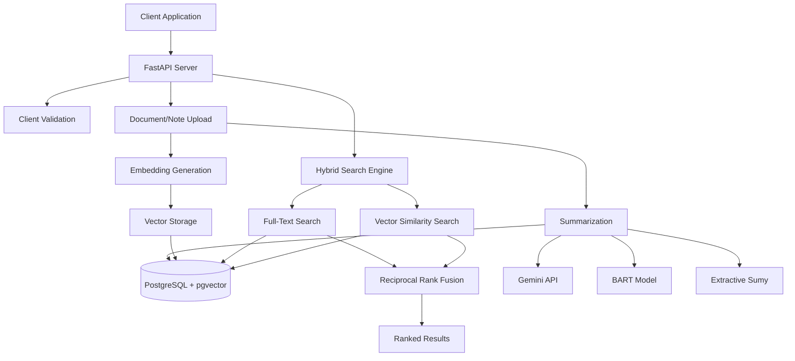

# WealthTech Smart Search API

A hybrid search system for financial advisors to search client documents and meeting notes using both keyword and semantic search, with AI-powered summarization.

## 🔍 Key Features

- **Hybrid Search**: Combines PostgreSQL full-text search with vector similarity using Reciprocal Rank Fusion
- **Semantic Understanding**: sentence-transformers embeddings with pgvector for context-aware search
- **AI Summarization**: Multiple techniques - Gemini API, BART transformer, and extractive methods
- **Financial Focus**: Optimized for investment documents, meeting notes, and client communications

## 🚀 Quick Start

### 1. Clone & Setup
```bash
git clone <repo-url>
cd project_20250915_2114_smart_search

# Set API key (recommended: .env file)
cp .env.example .env
nano .env  # Edit: GEMINI_API_KEY=your-actual-gemini-api-key

# Start application
docker compose up -d
```

**Alternative: Environment Variable**
```bash
export GEMINI_API_KEY="your-gemini-api-key-here"
docker compose up -d
```

### 2. Verify Setup
```bash
curl http://localhost:8000/health  # Should return: {"status":"healthy"}
open http://localhost:8000/docs    # Interactive API documentation
```

## 🤖 Summarization Techniques

The system supports three summarization approaches, configurable via environment variable:

### Gemini API (Default)
- **Method**: Advanced language model summarization
- **Quality**: Highest - contextual, coherent summaries
- **Requirements**: API key required
- **Use Case**: Production deployments with API access

### BART Transformer
- **Method**: Local Facebook BART model
- **Quality**: High - abstractive neural summarization  
- **Requirements**: No API key, higher memory usage
- **Use Case**: Offline environments, data privacy requirements

### Extractive
- **Method**: Sentence ranking and extraction (Sumy)
- **Quality**: Good - preserves original text
- **Requirements**: Minimal resources
- **Use Case**: Fast processing, resource-constrained environments

```bash
# Switch techniques
export SUMMARIZER="gemini"      # Default
export SUMMARIZER="bart"        # Local transformer
export SUMMARIZER="extractive"  # Sentence extraction
docker compose restart api
```

## 🏗️ Architecture



### Design Trade-offs

**Hybrid Search vs Pure Vector Search**
- ✅ Better relevance: Combines exact keyword matching with semantic similarity
- ✅ Handles both specific terms and conceptual queries
- ❌ Slightly more complex than single approach

**Multiple Summarization Options**
- ✅ Flexibility: Choose based on requirements (quality vs cost vs privacy)
- ✅ Fallback: Local methods when API unavailable
- ❌ Increased complexity and dependencies

**PostgreSQL + pgvector vs Dedicated Vector DB**
- ✅ Simpler deployment: Single database for all data
- ✅ ACID compliance: Consistent transactions
- ❌ Potentially slower than specialized vector databases at scale

## 📁 Code Structure

```
src/
├── main.py              # FastAPI application entry point
├── config.py            # Environment-based configuration
├── database.py          # SQLAlchemy database connection
├── api/                 # HTTP API layer
│   ├── documents.py     # Document upload endpoints
│   ├── notes.py         # Meeting notes endpoints
│   ├── search.py        # Hybrid search endpoints
│   └── schemas.py       # Pydantic request/response models
├── models/              # Data layer
│   └── database.py      # SQLAlchemy ORM models (Tenant, Client, Document, Note)
└── utils/               # Business logic utilities
    ├── embedder.py      # sentence-transformers embedding generation
    ├── summarizer.py    # Multi-method summarization (Gemini/BART/Extractive)
    ├── search_utils.py  # Reciprocal Rank Fusion algorithm
    └── validation.py    # Input validation helpers
```

**Key Design Decisions:**
- **Separation of Concerns**: API, models, and utilities clearly separated
- **Dependency Injection**: Configuration and services injected via FastAPI
- **Type Safety**: Pydantic schemas for all API contracts
- **Async Support**: FastAPI async handlers for better concurrency

## 📡 API Usage

### Endpoints
- `POST /clients/{id}/documents` - Upload documents with auto-summarization
- `POST /clients/{id}/notes` - Upload meeting notes with auto-summarization
- `GET /search?q=query&type=document|note` - Hybrid search with RRF ranking
- `GET /health` - Health check endpoint

### Upload Examples

**Upload Investment Document**
```bash
curl -X POST "http://localhost:8000/clients/1/documents" \
  -H "Content-Type: application/json" \
  -d '{
    "title": "Q3 Portfolio Performance Report",
    "content": "The client portfolio achieved a 12.5% return this quarter, outperforming the S&P 500 by 2.3%. Asset allocation remains at 70% equities, 25% bonds, 5% cash. Key holdings include technology sector ETFs and dividend-focused mutual funds. Recommend rebalancing to reduce concentration risk in growth stocks."
  }'
```

**Upload Meeting Note**
```bash
curl -X POST "http://localhost:8000/clients/1/notes" \
  -H "Content-Type: application/json" \
  -d '{
    "content": "Client consultation on retirement planning. Sarah, age 52, wants to retire at 62. Current 401k balance: $485K. Contributing $22K annually. Discussed Roth conversion strategy and healthcare cost planning. Action items: review Social Security projections, increase emergency fund to 6 months expenses."
  }'
```

### Search Examples

**Search Across All Content (Documents + Notes)**
```bash
# Hybrid search across both documents and notes
curl "http://localhost:8000/search?q=retirement%20planning"
```

**Search Only Documents**
```bash
# Find investment-related documents
curl "http://localhost:8000/search?q=portfolio%20performance&type=document"
```

**Search Only Notes**
```bash
# Find client meeting discussions
curl "http://localhost:8000/search?q=401k%20contribution&type=note"
```

**Complex Search Queries**
```bash
# Semantic search for financial concepts
curl "http://localhost:8000/search?q=asset%20allocation%20strategy"

# Keyword search for specific terms
curl "http://localhost:8000/search?q=Roth%20conversion"
```

### Response Format
```json
{
  "query": "retirement planning",
  "results": [
    {
      "id": 2,
      "type": "note",
      "title": null,
      "summary": "Client consultation on retirement planning for Sarah, age 52, targeting retirement at 62 with current 401k balance of $485K.",
      "content": "Client consultation on retirement planning. Sarah, age 52...",
      "score": 0.92
    },
    {
      "id": 1,
      "type": "document",
      "title": "Q3 Portfolio Performance Report",
      "summary": "Portfolio achieved 12.5% return this quarter, outperforming S&P 500, with recommendations for rebalancing.",
      "content": "The client portfolio achieved a 12.5% return...",
      "score": 0.78
    }
  ]
}
```

**Search Features:**
- **Ranking**: Results ranked by relevance score (0.0-1.0)
- **Mixed Results**: Documents and notes can appear together when `type` not specified
- **Summaries**: AI-generated summaries for quick scanning
- **Full Content**: Complete original text available for detailed review

## 🧪 Testing

### Test Coverage
- **Unit Tests (17)**: Core business logic, edge cases, error handling
- **Integration Tests (11)**: End-to-end API functionality, all summarization methods
- **Total Coverage**: 28 tests covering search algorithms, AI integration, API contracts

### Running Tests
```bash
# All tests (requires running API)
docker compose exec api python -m pytest tests/ -v

# Unit tests only (~10s)
docker compose exec api python -m pytest tests/test_unit.py -v

# Integration tests (~25s)
docker compose exec api python -m pytest tests/test_integration.py -v
```

### Test Data
Integration tests use realistic financial content:
- Investment portfolio analyses
- Client meeting notes on retirement planning
- Risk assessment documents
- Asset allocation strategies

## 📚 Documentation

- **Interactive API Docs**: http://localhost:8000/docs (Swagger UI)
- **Alternative Format**: http://localhost:8000/redoc (ReDoc)
- **Static Documentation**: [docs/API.md](docs/API.md)
- **OpenAPI Schema**: [docs/openapi.json](docs/openapi.json)

### Auto-Update Documentation
```bash
# Manual update (requires running API)
./scripts/update-docs.sh

# Automatic updates via GitHub Actions on API changes
```

## 🆘 Troubleshooting

### Common Issues

**API Key Errors**
```bash
# Verify key is set
echo $GEMINI_API_KEY

# Use local summarization as fallback
export SUMMARIZER="bart"
docker compose restart api
```

**Container Issues**
```bash
# Restart all services
docker compose down && docker compose up -d

# Check service logs
docker compose logs api
docker compose logs db
```

**Database Connection**
```bash
# Verify database is running
docker compose ps

# Check database logs
docker compose logs db

# Reset database (removes all data)
docker compose down -v && docker compose up -d
```

**Performance Issues**
- BART model: High memory usage (~2GB), slower startup
- Gemini API: Rate limits may apply
- Vector search: Performance scales with document count
